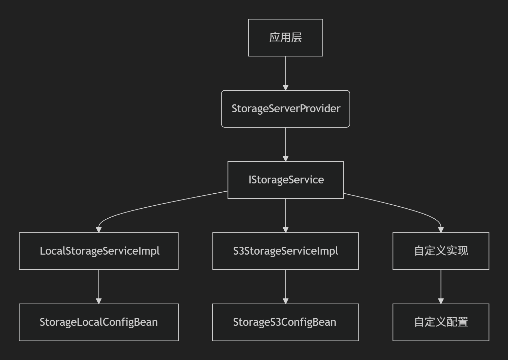

Storage Spring Boot Starter
===========================

设计思路
----

### 核心目标

提供一套**统一、可扩展的存储服务抽象层**，解决以下问题：

1. 屏蔽不同存储实现（本地、云存储等）的技术差异
2. 提供一致的API接口处理文件上传、下载和管理
3. 支持动态切换存储策略，无需修改业务代码
4. 简化存储服务的集成和使用

### 架构设计



### 技术点

1. ​**动态装配机制**​：
   
   * 基于`@Conditional`的条件化自动配置
   * 运行时根据配置文件选择存储实现

2. ​**泛型配置注入**​：
   
   ```java
   public interface IStorageService<T extends StorageConfigBean> {
       void setStorageConfig(T config);
   }
   ```
   
   * 通过反射获取泛型参数类型
   * 自动注入对应配置Bean

3. ​**可扩展性设计**​：
   
   * SPI(Service Provider Interface)模式
   * 支持第三方存储实现无缝集成
     
     

解决的问题场景
-------

### 典型使用场景

1. ​**多环境存储适配**​
   
   * 开发环境使用本地存储
   * 生产环境使用云存储(S3/OSS等)

2. ​**混合存储策略**​
   
   * 普通文件使用本地存储
   * 大文件使用云存储
   * 临时文件使用内存存储

3. ​**存储服务迁移**​
   
   * 从本地存储迁移到云存储
   * 在不同云服务商之间切换

4. ​**微服务统一存储方案**​
   
   * 多个服务使用同一套存储API
   * 集中管理存储配置

使用指南
----

### 1. 添加依赖

```xml
<dependency>
    <groupId>com.sre</groupId>
    <artifactId>storage-spring-boot-starter</artifactId>
    <version>1.0.0</version>
</dependency>
```


### 2. 基础配置

​**application.yml**​

```yaml
application:
  storage:
    enabled: true
    type: local # 存储类型(local/s3/custom)

    # 本地存储配置
    local:
      config:
        save-root-path: /data/storage
        public-path: https://cdn.example.com
        temp-file-save-path: /tmp
        temp-public-path: https://cdn.example.com/temp
```


### 3. 核心API使用

```java
@RestController
public class FileController {

    @Autowired
    private StorageServerProvider storageProvider;

    // 文件上传
    @PostMapping("/upload")
    public String upload(@RequestParam MultipartFile file) {
        FileSaveResult result = storageProvider.uploadFile(file);
        if (result.getSuccessFlag()) {
            return "File uploaded: " + result.getPublicPath();
        }
        return "Upload failed: " + result.getErrorMsg();
    }

    // 文件下载
    @GetMapping("/download/{uuid}")
    public ResponseEntity<Resource> download(
            @PathVariable String uuid,
            @RequestParam String ext) {

        File file = storageProvider.getFile(uuid, ext);
        return ResponseEntity.ok()
                .header(HttpHeaders.CONTENT_DISPOSITION, "attachment")
                .body(new FileSystemResource(file));
    }
}
```


### 4. 高级功能：分片上传

​**启用配置**​

```yaml
application:
  storage:
    config:
      enabledFragmentUpload: true
      fragmentUploadType: s3
```

​**代码示例**​

```java
@Autowired
private FragmentUploadServerProvider fragmentProvider;

public void uploadLargeFile(File partFile) {
    // 分片上传逻辑
    // 前置操作: 添加锁...
    fragmentProvider(partFile,uuid,Boolean.False ...)
    // 后置操作: 释放

```


### 5. 扩展自定义存储

​**步骤1：实现存储服务接口**​

```java
@Service
public class CustomStorageService implements IStorageService<CustomStorageConfig> {
    
    @Override
    public FileSaveResult uploadFile(MultipartFile file) {
        // 自定义实现逻辑
    }
    
    // 实现其他接口方法...
}
```

​**步骤2：创建配置类**​

```java
@Data
@Component
@ConfigurationProperties(prefix = "application.storage.custom.config")
public class CustomStorageConfig extends StorageConfigBean {
    private String endpoint;
    private String apiKey;
    private String secretKey;
    private String bucketName;
}
```

​**步骤3：启用自定义存储**​

```yaml
application:
  storage:
    type: custom
    custom:
      config:
        endpoint: https://api.custom-storage.com
        api-key: your-api-key
        secret-key: your-secret
        bucket-name: my-bucket
```


配置选项参考
------

| 配置项                                                | 类型      | 默认值   | 说明                    |
| -------------------------------------------------- | ------- | ----- | --------------------- |
| `application.storage.enabled`                      | boolean | true  | 是否启用存储模块              |
| `application.storage.type`                         | string  | local | 存储类型(local/s3/custom) |
| `application.storage.config.enabledFragmentUpload` | boolean | false | 是否启用分片上传              |
| `application.storage.config.fragmentUploadType`    | string  | -     | 分片上传存储类型              |

​**存储类型特定配置**​

* ​**本地存储**​
  
  * `save-root-path`: 文件存储根路径
  * `public-path`: 公开访问基础URL
  * `temp-file-save-path`: 临时文件存储路径
  * `temp-public-path`: 临时文件公开URL
  
  

版本说明
----

* ​**1.0.0**​ (2025-07-21)
  * 初始版本发布
  * 支持本地存储
  * 提供分片上传基础框架


